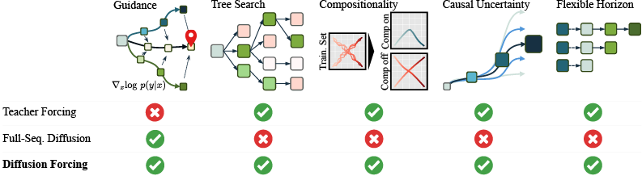

# Diffusion Forcing: Next-token Prediction Meets Full-Sequence Diffusion

#### [[Project Website]](https://boyuan.space/diffusion-forcing) [[Paper]](https://arxiv.org/abs/2407.01392)

[Boyuan Chen<sup>1</sup>](https://boyuan.space/), [Diego Martí Monsó<sup>2</sup>](https://www.linkedin.com/in/diego-marti/?originalSubdomain=de), [ Yilun Du<sup>1</sup>](https://yilundu.github.io/), [Max Simchowitz<sup>1</sup>](https://msimchowitz.github.io/), [Russ Tedrake<sup>1</sup>](https://groups.csail.mit.edu/locomotion/russt.html), [Vincent Sitzmann<sup>1</sup>](https://www.vincentsitzmann.com/) <br/>
<sup>1</sup>MIT <sup>2</sup>Technical University of Munich </br>

This is the code base for our paper [Diffusion Forcing: Next-token Prediction Meets Full-Sequence Diffusion](https://boyuan.space/diffusion-forcing).



**Cite**

```
@misc{chen2024diffusionforcingnexttokenprediction,
      title={Diffusion Forcing: Next-token Prediction Meets Full-Sequence Diffusion},
      author={Boyuan Chen and Diego Marti Monso and Yilun Du and Max Simchowitz and Russ Tedrake and Vincent Sitzmann},
      year={2024},
      eprint={2407.01392},
      archivePrefix={arXiv},
      primaryClass={cs.LG},
      url={https://arxiv.org/abs/2407.01392},
}
```

### 3D-UNet & Temporal Attention Implmentation

~~An amazing MIT undergrad [Kiwhan Song](https://www.linkedin.com/in/kiwhan-song/) working with us reimplemented diffusion forcing with 3D-unet & temporal attention at [this repo](https://github.com/kwsong0113/diffusion-forcing-transformer). We observe much better results with this improved architecture specialized for video generation, although our paper is exclusively using this repo's non transformer implementation.~~ Checkout the `main` branch of the code.

# Project Instructions

## Setup

Create conda environment:

```
conda create python=3.10 -n diffusion_forcing
conda activate diffusion_forcing
```

Install dependencies for time series, video and robotics:

```
pip install -r requirements.txt
```

[Sign up](https://wandb.ai/site) a wandb account for cloud logging and checkpointing. In command line, run `wandb login` to login.

Then modify the wandb entity in `configurations/config.yaml` to your wandb account.

Optionally, if you want to do maze planning, install the following complicated dependencies due to outdated dependencies of d4rl. This involves first installing mujoco 210 and then run

```
pip install -r extra_requirements.txt
```

## Quick start with pretrained ckpt

Since dataset is huge, we provide a mini subset and pre-trained checkpoints for you to quickly test out our model! To do so, download mini dataset and checkpoints from [here](https://drive.google.com/file/d/1UU_epzCAT7VLMLyHAsX2LusGCVeowDf8/view?usp=sharing) to project root and extract with ` tar -xzvf  quickstart.tar.gz`. Files shall appear as `data/dmlab`, `data/minecraft`, `outputs/dmlab.ckpt`, `outputs/minecraft.ckpt`. Checkpoints for 3D Unet version of diffusion forcing is in the README of ~~that [repo](https://github.com/kwsong0113/diffusion-forcing-transformer) (it's better in quality but one has to use sliding window since it's attention).~~ the `main` branch of the code.

Then run the following commands and go to the wandb panel to see the results. Our visualization is side by side, with prediction on the left and ground truth on the right. However, ground truth is expected to not align with prediction since the sequence is highly stochastic. Ground truth is provided to provide an idea about quality only.

### DMLab:

`python -m main +name=dmlab_pretrained algorithm=df_video experiment=exp_video dataset=video_dmlab algorithm.diffusion.num_gru_layers=0 experiment.tasks=[validation] load=outputs/dmlab.ckpt`

### Minecraft:

`python -m main +name=minecraft_pretrained algorithm=df_video experiment=exp_video dataset=video_minecraft algorithm.frame_stack=8 algorithm.diffusion.network_size=64 algorithm.diffusion.beta_schedule=sigmoid algorithm.diffusion.cum_snr_decay=0.96 algorithm.z_shape=[32,128,128] load=outputs/minecraft.ckpt`

### Infinite Rollout

To let the model rollout longer than it's trained on without sliding window, simply append something like`dataset.n_frames=400` to the above commands.

## Train your own model

### Video Prediction

Make sure you also checkout ~~this 3rd party [3D-unet & transformer implementation](https://github.com/kwsong0113/diffusion-forcing-transformer) if you want a better, modern architecture.~~ the `main` branch for temporal attention version of the code for better quality.

Video prediction requires downloading giant datasets. First, if you downloaded the mini subset following `Try pretrained video model` section, delete the mini subset folders `data/minecraft` and `data/dmlab`. Them just run the following commands: we've coded in python that it will download the dataset for you it doesn't already exist. Due to the slowness of the [source](https://github.com/wilson1yan/teco), this may take a couple days. If you prefer to do it yourself via bash script, please refer to the bash scripts in original [TECO dataset](https://github.com/wilson1yan/teco) and use `dmlab.sh` and `minecraft.sh` in their Dataset section of README, any maybe split bash script into parallel scripts.

Train on TECO DMLab dataset:

`python -m main +name=dmlab_video algorithm=df_video experiment=exp_video dataset=video_dmlab algorithm.diffusion.num_gru_layers=0`

Train on TECO Minecraft dataset:

`python -m main +name=minecraft_video algorithm=df_video experiment=exp_video dataset=video_minecraft experiment.training.batch_size=16 algorithm.frame_stack=8 algorithm.diffusion.network_size=64 algorithm.diffusion.beta_schedule=sigmoid algorithm.diffusion.cum_snr_decay=0.96 algorithm.z_shape=[32,128,128]`

We are training with 8 GPU by default, if you use fewer or smaller batch size, please lower the learning rate `algorithm.lr=2e-4` proportionally. Convergence should be around 50k steps and should take less than a day.

After the model is trained to convergence, you can use the model to roll out longer than it's trained on via appending the following command to correspond training command:
`experiment.tasks=[validation] dataset.n_frames=1000 load={wandb_id_of_training_run}`

### Robot Imitation Learning

Train the model with command
`python -m main +name=robot_new dataset=robot_swap algorithm=df_robot experiment=exp_robot`

To run on the real robot, connect two realsense cameras to the server and run
`python -m main +name=robot_new dataset=robot_swap algorithm=df_robot experiment=exp_robot experiment.tasks=[test] load={wandb_id_of_training_run}`
The robot will send a plan to a specified port via zeromq, upon receiving a planning request. Robot code is by request.

### Maze2d Planning

**We are about to release transformer version of maze planning, with much stronger result and faster speed**, so this version will be deprecated soon.

First, make sure you perform the optinal steps in setup instructions so all planning specific dependencies are installed. Then,

Train your model with
`python -m main +name=planning_medium experiment=exp_planning dataset=maze2d_medium algorithm=df_planning`.

The model will converge within 100k steps. To test planning, append the following to your training command:
`experiment.tasks=[validation] algorithm.guidance_scale=8.0 experiment.validation.precision=32 load={wandb_id_of_training_run}`.
To obtain numbers reported in paper, guidance scale of 8.0 to 12.0 are recommended. To reproduce visualizations shown on the website, a guidance scale of 0.1-1.0 shall suffice.

### Timeseries Prediction

Train model with command:
`python -m main +name=ts_exchange dataset=ts_exchange algorithm=df_prediction experiment=exp_prediction`

# Infra instructions

This repo is forked from [Boyuan Chen](https://boyuan.space/)'s research template [repo](https://github.com/buoyancy99/research-template). By its MIT license, you must keep the above sentence in `README.md` and the `LICENSE` file to credit the author.

All experiments can be launched via `python -m main [options]` where you can fine more details in the following paragraphs.

## Pass in arguments

We use [hydra](https://hydra.cc) instead of `argparse` to configure arguments at every code level. You can both write a static config in `configuration` folder or, at runtime,
[override part of yur static config](https://hydra.cc/docs/tutorials/basic/your_first_app/simple_cli/) with command line arguments.

For example, arguments `algorithm=df_prediction algorithm.diffusion.network_size=32` will override the `network_size` variable in `configurations/algorithm/df_prediction.yaml`.

All static config and runtime override will be logged to wandb automatically.

## Resume a checkpoint & logging

All checkpoints and logs are logged to cloud automatically so you can resume them on another server. Simply append `resume=[wandb_run_id]` to your command line arguments to resume it. The run_id can be founded in a url of a wandb run in wandb dashboard.

On the other hand, sometimes you may want to start a new run with different run id but still load a prior ckpt. This can be done by setting the `load=[wandb_run_id / ckpt path]` flag.

## Modify for your own project

Add your method and baselines in `algorithms` following the `algorithms/README.md` as well as the example code in
`algorithms/examples/classifier/classifier.py`. For pytorch experiments, write your algorithm as a [pytorch lightning](https://github.com/Lightning-AI/lightning)
`pl.LightningModule` which has extensive
[documentation](https://lightning.ai/docs/pytorch/stable/). For a quick start, read "Define a LightningModule" in this [link](https://lightning.ai/docs/pytorch/stable/starter/introduction.html). Finally, add a yaml config file to `configurations/algorithm` imitating that of `configurations/algorithm/df_base.yaml`, for each algorithm you added.

(If doing machine learning) Add your dataset in `datasets` following the `datasets/README.md` as well as the example code in
`datasets/offline_rl/maze2d.py`. Finally, add a yaml config file to `configurations/dataset` imitating that of
`configurations/dataset/maze2d_large.yaml`, for each dataset you added.

Add your experiment in `experiments` following the `experiments/README.md` or following the example code in
`experiments/exp_video.py`. Then register your experiment in `experiments/__init__.py`.
Finally, add a yaml config file to `configurations/experiment` imitating that of
`configurations/experiment/exp_video.yaml`, for each experiment you added.

Modify `configurations/config.yaml` to set `algorithm` to the yaml file you want to use in `configurations/algorithm`;
set `experiment` to the yaml file you want to use in `configurations/experiment`; set `dataset` to the yaml file you
want to use in `configurations/dataset`, or to `null` if no dataset is needed; Notice the fields should not contain the
`.yaml` suffix.

You are all set!

`cd` into your project root. Now you can launch your new experiment with `python main.py +name=example_name`. You can run baselines or different datasets by add arguments like `algorithm=[xxx]` or `dataset=[xxx]`. You can also override any `yaml` configurations by following the next section.

One special note, if your want to define a new task for your experiment, (e.g. other than `training` and `test`) you can define it as a method in your experiment class (e.g. the `save_mean_std_metadata` task in `experiments/exp_prediction.py`) and use `experiment.tasks=[task_name]` to run it. Let's say you have a `generate_dataset` task before the task `training` and you implemented it in experiment class, you can then run `python -m main +name xxxx experiment.tasks=[generate_dataset,training]` to execute it before training.
